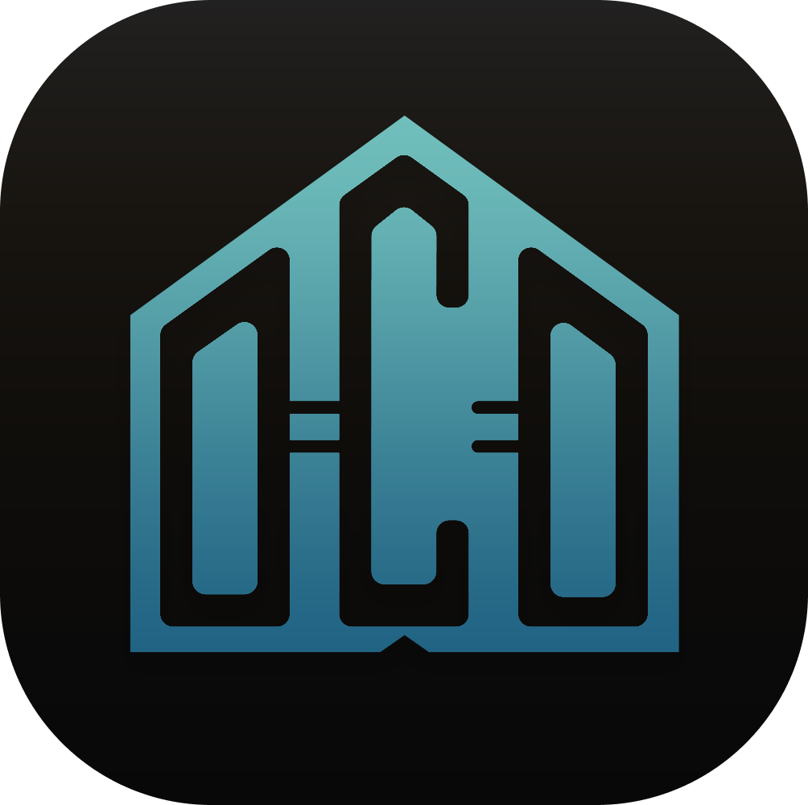

<p align="center">
 
 <h2 align="center">UCDT Series</h2>
 <p align="center">Get UCDT Series Apps</p>
</p>

## Project Status

- Current project package version: `1.7.0`
- The landing page is in an active maintenance phase with the current single-route UI preserved

## Features

- Single-page tabbed product experience for 5 UCDT applications
- Dark glassmorphism visual system for the UCDT landing experience
- Centered hero layout with GitHub CTA and per-platform download buttons
- macOS download button uses a two-option CPU dropdown, Windows stays direct-download, and Linux routes users to the relevant GitHub repository for source-based builds
- Chinese / English content switching
- Real release metadata and GitHub Releases links for Processing, Analysis, and Computing
- Procedural concept visuals retained as the main preview layer
- Real screenshots rendered below the concept visual when available
- Stable centered screenshot lightbox with dark overlay, blur, and animated thumbnail expansion
- Shared metadata, route-based app icons, and social image routes for deployment readiness
- Vercel-friendly Next.js structure

## Architecture

- `app/page.tsx`: single-route entry that renders the download page
- `components/download-page.tsx`: stateful composition layer for locale, active product, and FAQ state
- `components/download-page-sections.tsx`: reusable presentational sections and display helpers
- `components/layout-spacing.ts`: shared Tailwind-first spacing and small alignment grammar for reusable section rhythm, including dedicated Hero and product switcher helpers for responsive spacing maintenance
- `components/product-preview.tsx`: preview video lifecycle, screenshot grid, and stabilized lightbox behavior
- `components/site-icons.tsx`: shared SVG icon primitives used across sections
- `data/products.ts`: source of truth for product copy, status, accents, versions, links, and workflow roles
- `lib/site-metadata.ts`: shared metadata configuration for layout, Open Graph, Twitter card, and canonical placeholders
- `app/favicon.ico`: committed favicon binary used for browser favicon resolution
- `app/icon.tsx`, `app/apple-icon.tsx`, `app/opengraph-image.tsx`, `app/twitter-image.tsx`, `app/manifest.ts`, `app/sw/route.ts`: generated asset, metadata, and service worker routes

## Development

Preferred shell on the current Windows workstation:

```bash
pwsh
```

All commands below are intended to run in `pwsh` from the repository root.

Install dependencies locally in this project:

```bash
pnpm install
```

Run the dev server:

```bash
pnpm dev
```

Create a production build:

```bash
pnpm build
```

## Package Manager

- This project uses `pnpm` as the only supported package manager.
- Install dependencies from the repository root so packages are placed in the current project only.
- Do not use `npm install` for this repository.
- On the current Windows machine, prefer PowerShell 7.4 (`pwsh`) over legacy Windows PowerShell.

## Content Source

Product copy, accent colors, version labels, release URLs, and product state are managed in:

- `data/products.ts`

Keep new marketing copy, FAQ content, workflow descriptions, and release-facing labels in this file so the page remains data-driven.

## Asset Conventions

- `assets/logo.png`: site logo
- Product `logo.png`: transparent product logo asset
- Product `logo-rounded.png`: product switcher icon
- Product `logo-words.png`: centered product wordmark
- Processing, Analysis, and Computing expose public GitHub release/license links

## Metadata and Icons

- App Router metadata is centralized in `lib/site-metadata.ts`
- On Vercel, metadata now defaults to the production origin `https://ucdt-app.vercel.app/` for canonical URL and absolute Open Graph / Twitter URL output
- `NEXT_PUBLIC_SITE_URL` remains the override if the project later moves to a custom domain
- The site currently defaults to author `ONing` and publisher `Bitcookies`
- `app/favicon.ico` is the committed browser favicon source
- `assets/logo.png` is the primary PWA / install identity asset and is resized through `lib/pwa-assets.ts`
- `app/icon.tsx`, `app/apple-icon.tsx`, and `app/pwa-icon-192/route.ts` provide PNG install icons for browser, Apple touch, and manifest usage
- Open Graph, Twitter, and manifest assets remain generated through App Router metadata routes
- `components/service-worker-registration.tsx` registers the dynamic `/sw` route backed by `app/sw/route.ts`, keeping the cache version synchronized with `package.json`

## Maintenance Notes

- Reuse the shared utility classes in `app/globals.css` before adding new long Tailwind class strings
- Reuse the shared section rhythm and alignment helpers in `components/layout-spacing.ts` before introducing new one-off spacing or dot/text alignment classes
- Prefer dedicated shared helpers in `components/layout-spacing.ts` for responsive Hero and product switcher spacing instead of reusing broad section padding tokens when a section needs different breakpoint behavior
- Keep the release notes hover card, macOS download dropdown, and macOS quarantine info tooltip visually aligned on the same opaque `release-popover` surface unless a design task explicitly separates them again
- Prefer extending `components/download-page-sections.tsx` or splitting out another section component instead of re-growing `download-page.tsx`
- Keep the page visually stable unless a design task explicitly asks for UI changes
- Use `text-balance` selectively for high-visibility headings, card titles, FAQ prompts, and long UI-facing summaries to reduce awkward single-word or single-character wrap lines
- When adding a released desktop app, update the product entry with `releaseUrl`, `repoUrl`, `license.url`, version, and platform availability together
- Keep the download CTA row feeling synchronized when switching active products; the platform buttons should update as a group instead of appearing to refresh left-to-right
- Keep screenshot preview behavior robust: Radix Dialog handles portal/overlay/scroll lock, while the lightweight proxy layer only adds motion polish and must never be the sole path to showing the enlarged image
- In the desktop `Module Responsibilities` cards, keep the icon on its own row at `xl` widths so bilingual text length does not squeeze the product mark
- Local terminal/media tooling currently available on the primary Windows workstation: `pwsh`, `magick convert`, `ffmpeg`, and an NVIDIA RTX 4060 Ti for future accelerated media-processing workflows
- The current repository root and project folder name is `ucdt-app`

## Deployment

This project is intended for deployment on Vercel.

## License

GPL 3.0
